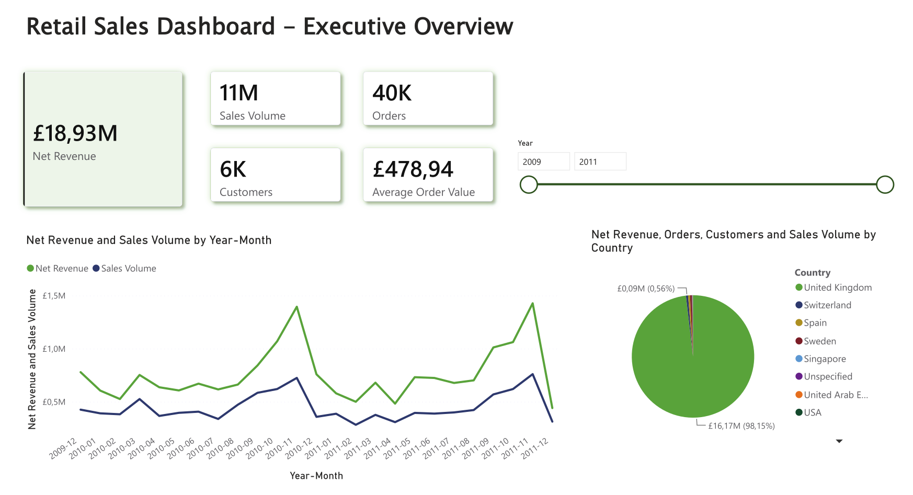
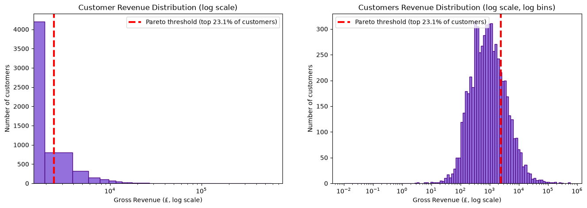
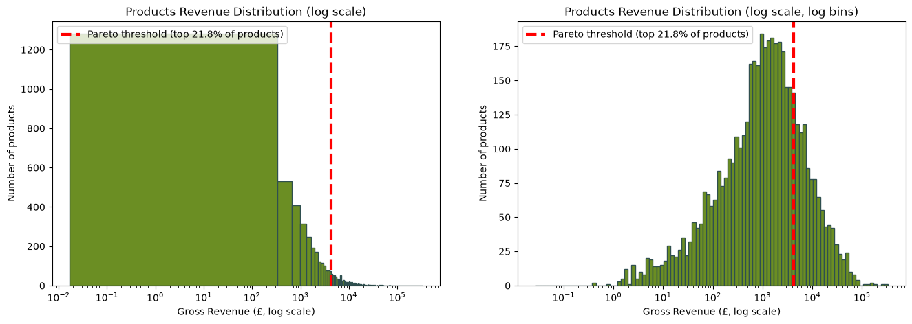
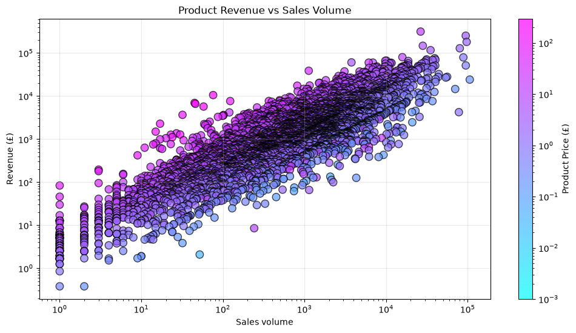
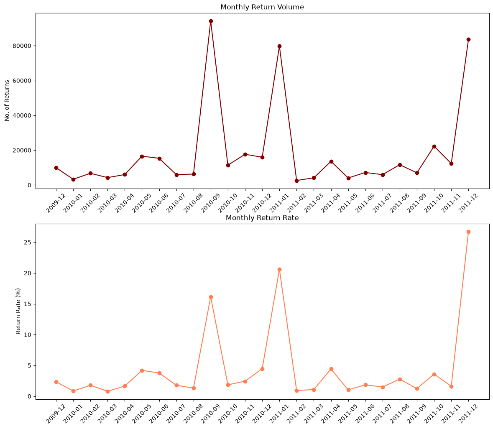
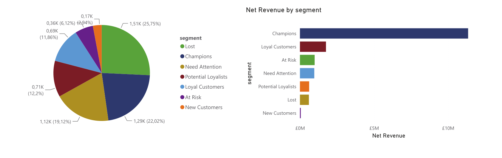

# Online Retail II — Business Analysis

Business analysis of the **Online Retail II** transactional dataset using Python, SQL and SQLite. The project investigates revenue concentration, geographic distribution, sales seasonality, product performance, returns, and customer behaviour.

---

## Project Overview

This project analyses transactional data from a UK-based online retailer covering the period from **December 2009 to December 2011**.

The project is structured into two main stages:

1. **Data Cleaning & ETL**: raw transactional data are assessed, cleaned, validated, transformed into sales and returns datasets, and loaded into a SQLite database.
2. **Business Analysis**: the cleaned data are analysed using SQL and Python to identify patterns in revenue, customers, products, seasonality, geography, and returns.

The analysis focuses on identifying **business-level patterns and actionable insights**.    
As a final step, a **PowerBI dashboard** was created to allow for a clearer visualization of the key trends and behaviours.

---

## Dataset

The project uses the **[Online Retail II dataset](https://archive.ics.uci.edu/dataset/502/online+retail+ii)** from the UCI Machine Learning Repository.

The dataset contains transactional records from a UK-based online retailer between December 2009 and December 2011.

The raw dataset is **not included in this repository**. To reproduce the analysis, download the dataset and place the raw file in the data folder.

---

## Project Structure

online-retail-analysis/
│
├── data/
│   ├── online_retail_II.csv
│   ├── retail.db
│   ├── sales_clean.csv
│   ├── returns_clean.csv
│   └── customers.csv
│
├── notebooks/
│   ├── 01_data_cleaning.ipynb
│   └── 02_business_analysis.ipynb
│
├── dashboard/
│   ├── online_retail_dashboard.pbix
│   └── online_retail_dashboard.pdf
│
├── images/
│   ├── cust_rev_distrib.png
│   ├── executive_overview.png
│   ├── prod_performance.png
│   ├── prod_rev_distrib.png
│   ├── returns.png
│   └── rfm.png
│
├── README.md
└── requirements.txt

---

## Data Pipeline

The project follows a simple Extract → Transform → Validate → Load workflow:

Raw CSV
   │
   ▼
Extract
   │
   ▼
Data Quality Assessment
   │
   ▼
Cleaning & Transformation
   │
   ▼
Validation
   │
   ▼
SQLite Database
   │
   ▼
SQL + Python Analysis
   │
   ▼
Business Insights & Power BI Dashboard

### 1. Data Cleaning & ETL

The first notebook performs:    
- raw data extraction    
- missing-value assessment    
- identification of invalid prices    
- identification of non-transactional records    
- duplicate removal    
- data type conversion    
- separation of sales and returns    
- data validation    
- loading of cleaned datasets into SQLite    
    

Cleaning decisions were dataset-specific and informed by exploratory data quality assessment.    

### 2. Business Analysis

The second notebook uses the SQLite database and Python (mostly Pandas) to investigate:    
- Revenue concentration    
- Geographic distribution    
- Sales seasonality    
- Product performance    
- Returns    
- Customer behaviour and segmentation analysis    

#### 2.1. Revenue Concentration    

This section investigates how revenue is distributed across customers and products.
The analysis includes:    
- Revenue distributions among customers and products    
- Gini coefficients    
- Pareto analysis    

#### 2.2 Geographic Analysis

This section analyses the geographic distribution of:    
- Sales volume    
- Net revenue    
- Customers    

#### 2.3 Sales Seasonality

Monthly and quarterly trends are analysed for:    
- Net revenue    
- Gross revenue    
- Sales volume    
- Number of transactions    
- Average order value (AOV)    

The analysis focuses particularly on the Q4 period and the contribution of different factors to the seasonal revenue peak.    

#### 2.4 Product Performance

Product performance is evaluated through:    
- Sales volume    
- Net revenue    
- Spearman correlation between volume and revenue    
- log-log analysis & residual analysis    

The residual analysis identifies products whose revenue is substantially higher or lower than expected given their sales volume.    
This allows the analysis to distinguish between high-volume products and products that generate relatively high revenue per unit.

#### 2.5 Returns Analysis

The returns analysis investigates:    
- Monthly and quarterly return volume & return rates    
- Country-level return behaviour    
- Product-level return behaviour    
- Anomalous return periods   
- Relationship between product price and return rate    

Several unusual spikes in return activity are investigated individually rather than automatically removed.    

#### 2.6 Customer Analysis

Customer behaviour is analysed using:    
- Top customers by net revenue    
- RFM analysis & customer segmentation    

The analysis investigates whether frequent customers also tend to generate higher-value orders and identifies the customer segments contributing most to total revenue.

### 3. Power BI Dashboard
The Power BI Dashboard provides an interactive visualisation of the key trends 
and statistics across 4 pages:    
- Executive Overview    
- Products    
- Returns    
- Customers.

The `.pbix` file is available in the `dashboard/` folder.

---

## Key Findings
- **Revenue concentration**: 23.1% of customers and 21.8% of products account for 80% of total net revenue.    
- **Geographic concentration**: the UK accounts for 91.1% of customers, 82.0% of sales volume, and 85.4% of total net revenue.    
- **Seasonality**: Q4 revenue is 63.4% above the average of the preceding three quarters in 2010 and 44.4% higher in 2011.    
- **Product performance**: sales volume and revenue show a strong positive relationship (Spearman ρ = 0.84), while residual analysis identifies notable products that deviate from this relationship.    
- **Returns**: excluding three anomalous months, the average monthly return rate is 2.1%, compared with 4.4% when the outliers are included.    
- **Customer value**: Champions represent 22% of customers but contribute 69% of total net revenue.

---

## Selected Visualisations
### Revenue Concentration

The revenue distributions show substantial inequality across both customers and products, with a small proportion of entities accounting for a large share of total revenue.

#### Product Performance

The relationship between product sales volume and revenue highlights both the strong overall correlation and the products that deviate substantially from the expected relationship.

#### Returns Analysis

Return activity is generally stable, with a small number of anomalous periods driven by isolated bulk-return events.

#### Customers Segmentation

Champions (customers with high frequency, recent purchases and high monetary contribution) constitute almost a quarter of the total customer base but contribute to almost 70% of the total net revenue.

---

## Tools
Python (Pandas, Matplotlib, Seaborn, Scipy), SQL, SQLite, Power BI

---

## Reproducibility

To reproduce the analysis:

- Download the Online Retail II dataset.    
- Place the raw dataset in data.    
- Install the required Python dependencies: '''pip install -r requirements.txt'''    
- Run 01_data_cleaning.ipynb:  this notebook performs the data cleaning and validation steps and creates the SQLite database.    
- Run 02_business_analysis.ipynb:  this notebook connects to the SQLite database and performs the business analysis.

---

## Conclusions

Overall, the retailer's performance is characterised by high customer and product concentration, strong dependence on the UK market, pronounced Q4 seasonality, and a relatively stable return pattern outside a small number of isolated bulk-return events.    
The combination of revenue concentration and RFM segmentation suggests that customer retention among high-value customers is particularly important, while the product analysis highlights opportunities to understand and manage differences in price and revenue generation across the portfolio.